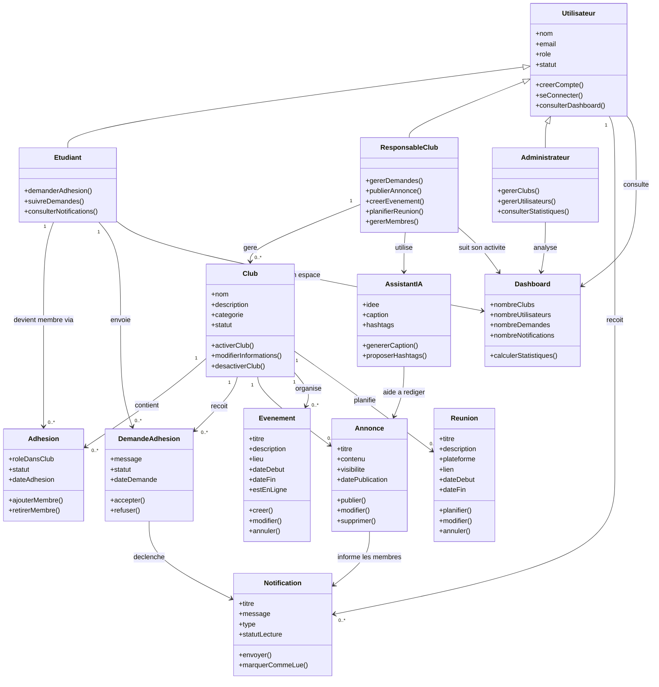
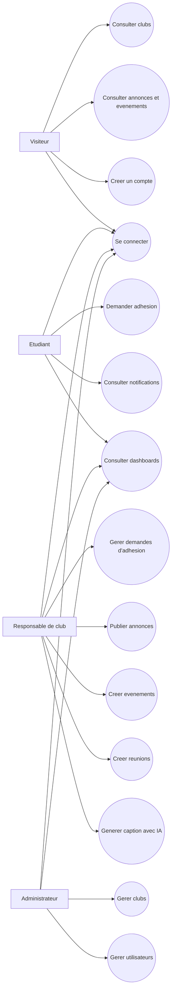
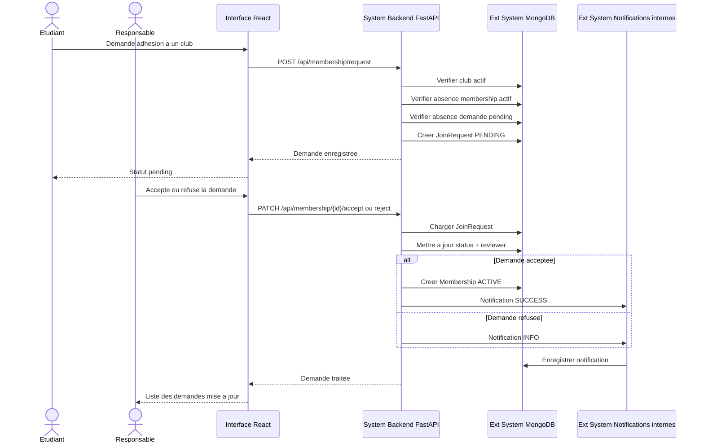
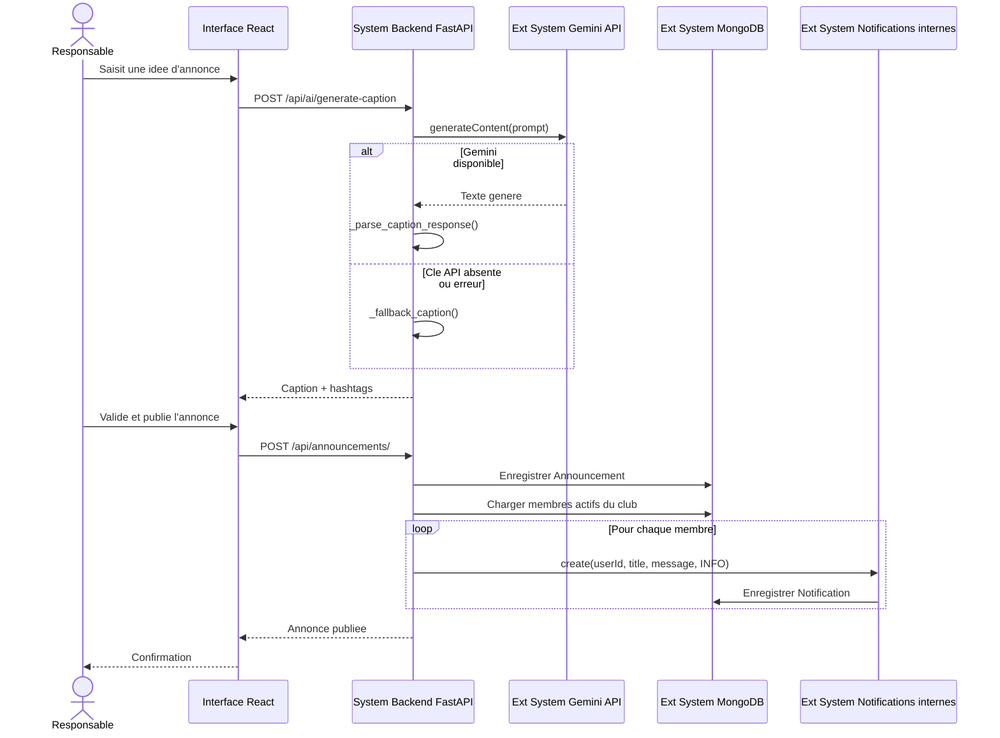

# ISET ClubHub - Diagrammes UML

Ces diagrammes representent uniquement les fonctionnalites implementees dans le projet actuel. Les methodes affichees sont des methodes metier importantes, pas des getters/setters.

## Diagramme de classes general

Ce diagramme donne une vue metier simple du projet. Il ne copie pas les noms exacts du code; il montre les objets importants de l'application et les actions principales que chaque objet permet de faire.



## Cas d'utilisation general



## Sequence: authentification

Modele utilise: actor / interface frontend / system backend / external systems.

```mermaid
sequenceDiagram
    actor Actor as Utilisateur
    participant Interface as Interface React
    participant System as System Backend FastAPI
    participant DB as Ext System MongoDB
    participant JWT as Ext System JWT

    Actor->>Interface: Saisit email et mot de passe
    Interface->>System: POST /api/auth/login
    System->>DB: Chercher utilisateur par email
    DB-->>System: Donnees utilisateur avec passwordHash
    System->>System: verify_password()
    System->>JWT: create_access_token(userId, role)
    JWT-->>System: Token signe
    System-->>Interface: user + token
    Interface-->>Actor: Acces au dashboard selon le role
```

## Sequence: demande d'adhesion et decision responsable



## Sequence: publication d'une annonce avec IA


